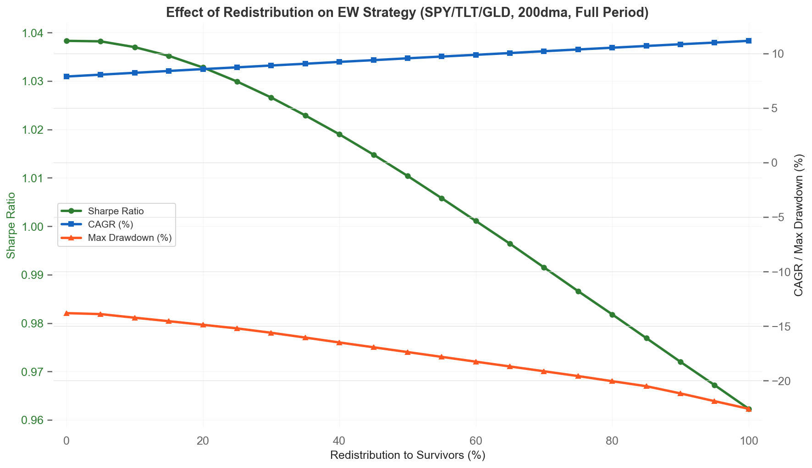
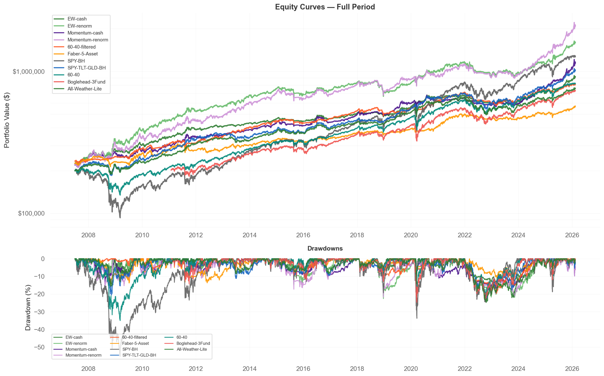
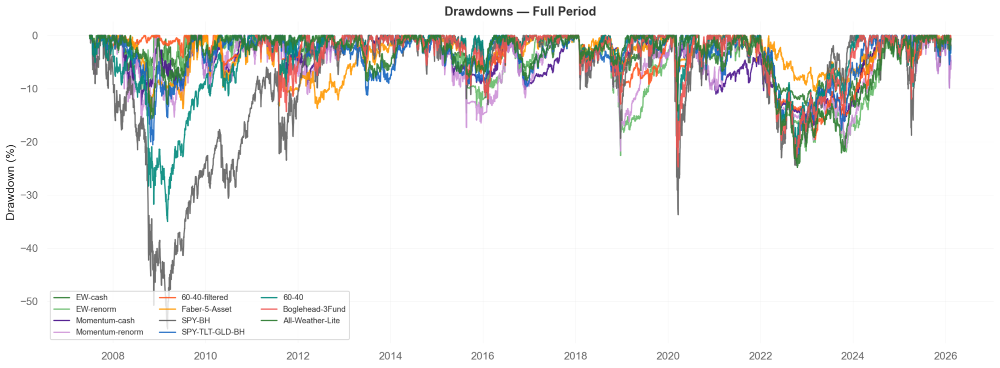
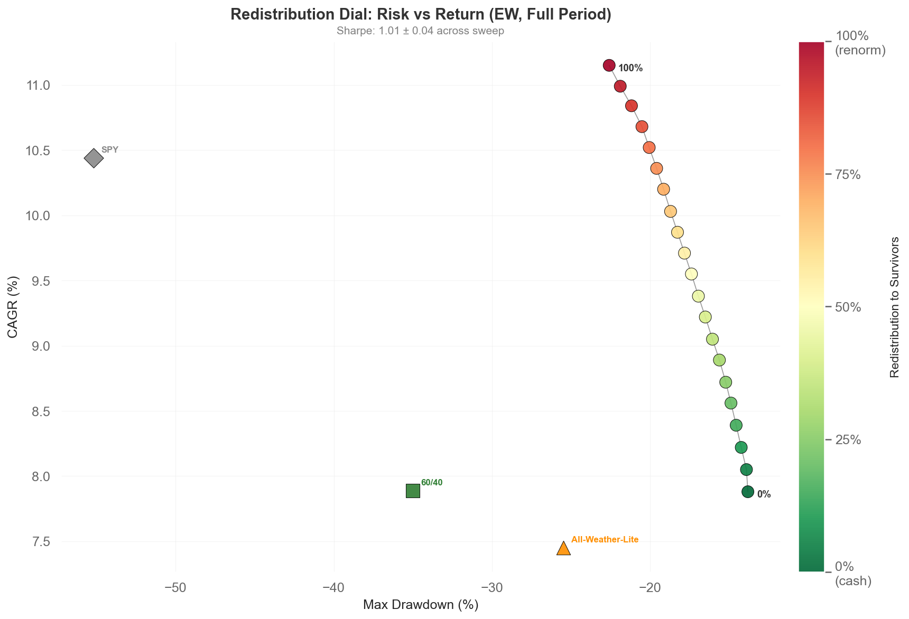
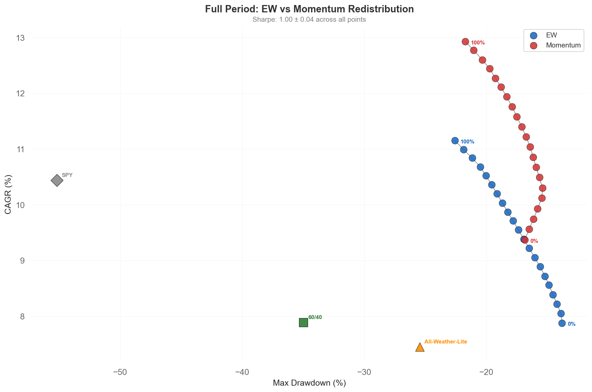
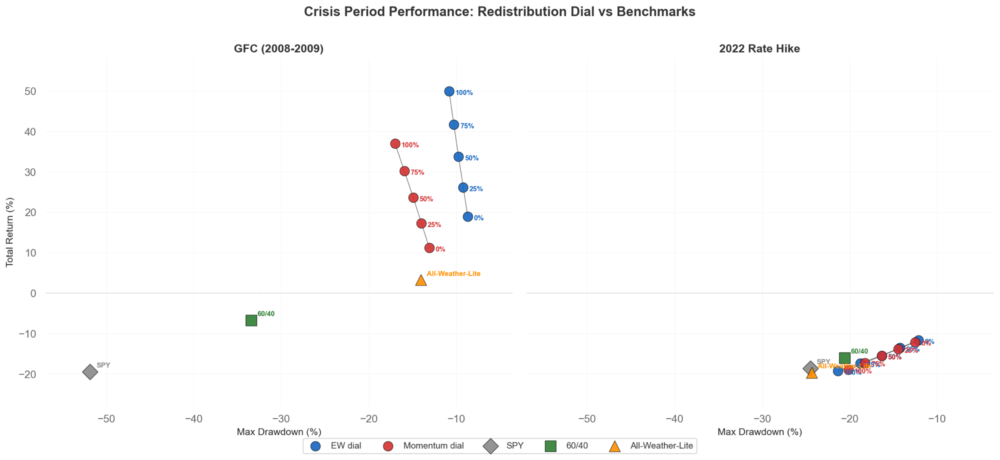
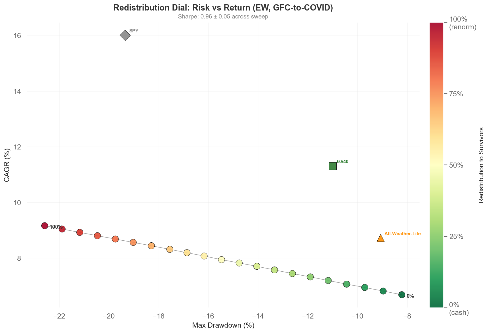
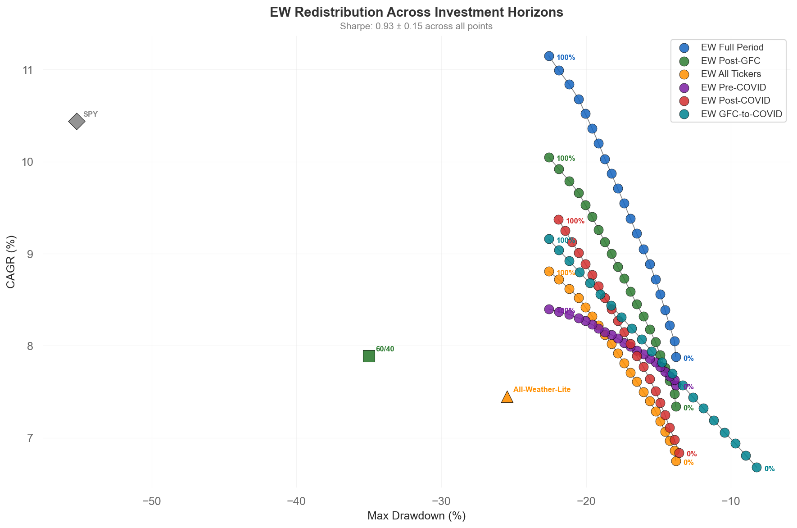

# Faber's 200dma Strategy Still Works. Here's What Happens When You Don't Exit to Cash.

## The Punchline

Mebane Faber's 2007 paper "A Quantitative Approach to Tactical Asset Allocation" is the most downloaded paper on SSRN. The idea: check each asset against its 200-day moving average once a month. Below? Exit to cash. Simple, and it works.

I implemented it on three ETFs (SPY, TLT, GLD) and confirmed it works. But Faber's paper treats the exit to cash as a given. What if you don't exit entirely to cash? What if you redistribute some or all of the freed capital to the surviving assets?

It turns out this is a continuous dial — from 0% redistribution (pure cash exit, Faber's version) to 100% redistribution (full renormalization). I swept this parameter and found that for these three assets, risk-adjusted returns stay roughly constant across the entire range. You're not choosing better or worse — you're choosing how much drawdown you can stomach.

|  | Cash Exit (0%) | Renormalize (100%) |
|---|---|---|
| **Equal Weight** | 1.04 Sharpe / 7.9% CAGR / -14% MaxDD | 0.96 Sharpe / 11.2% CAGR / -23% MaxDD |
| **Momentum Tilt** | 0.98 Sharpe / 9.4% CAGR / -17% MaxDD | 0.97 Sharpe / 13.1% CAGR / -22% MaxDD |

## The Base Strategy

Three funds:
- **SPY** — S&P 500 (US equities)
- **TLT** — 20+ Year Treasury Bonds
- **GLD** — Gold

Equal weight (33/33/33). On the last trading day of each month, check each fund against its own 200-day simple moving average. If it's below, that fund's allocation is freed up. What you do with that freed capital is the parameter.

Faber published the core idea in 2007 ([SSRN link](https://ssrn.com/abstract=962461)). His version uses 5 asset classes (US stocks, international stocks, commodities, REITs, bonds) and always exits to cash. The 200dma filter, monthly evaluation, and per-asset filtering are all his design.

### Does the filter actually help?

| | SPY/TLT/GLD Buy-and-Hold | With 200dma Filter (EW-cash) | Delta |
|---|---|---|---|
| CAGR | 9.2% | 7.9% | -1.3% |
| Max Drawdown | -23.1% | -13.8% | +9.3% |
| Sharpe | 0.95 | 1.04 | +0.09 |

The filter cuts max drawdown by 40% and improves Sharpe from 0.95 to 1.04. It costs ~1.3% CAGR — the price of trend following. Whether that tradeoff is worth it depends on how much you value drawdown protection.

### Benchmarks

| Benchmark | Sharpe | CAGR | Max Drawdown |
|---|---|---|---|
| SPY buy-and-hold | 0.60 | 10.4% | -55.2% |
| 60/40 (SPY/AGG) | 0.70 | 7.9% | -35.0% |
| 60/40 with 200dma filter | 0.92 | 6.9% | -19.6% |
| Faber 5-asset (SPY/EFA/DBC/VNQ/IEF) with 200dma | 0.66 | 5.1% | -15.8% |

60/40 filtered vs our 3-fund filtered (EW-cash): GLD adds real value — 1.04 vs 0.92 Sharpe. Faber's 5-asset has the shallowest drawdown (-15.8%) but DBC and VNQ drag returns down to 5.1% CAGR. Our 3-fund wins on Sharpe and CAGR. Caveat: comparison only works from ~2007 due to ETF availability; Faber tested from 1972 with index data.

## The Redistribution Dial

When a fund drops below its 200dma, its weight is freed. You have a choice:

- **0% redistribution (cash exit):** Freed weight goes to cash (SHY). Portfolio shrinks. Conservative.
- **100% redistribution (renormalize):** Freed weight is split among survivors proportionally. Portfolio stays ~100% invested. Aggressive.
- **Anything in between:** X% to cash, (100-X)% redistributed to survivors.

| Redistribution % | Sharpe | CAGR | Max Drawdown |
|---|---|---|---|
| 0% (cash exit) | 1.04 | 7.9% | -13.8% |
| 25% | 1.03 | 8.7% | -15.2% |
| 50% | 1.01 | 9.6% | -17.4% |
| 75% | 0.99 | 10.4% | -19.6% |
| 100% (renormalize) | 0.96 | 11.2% | -22.6% |

Sharpe stays within a ~0.08 band across the entire range. CAGR climbs monotonically from 7.9% to 11.2%. Max drawdown worsens monotonically from -13.8% to -22.6%. This monotonic pattern holds across every time window we tested.

This means the cash-vs-renormalize choice isn't an optimization — it's a risk appetite dial. You're choosing how much drawdown you can stomach in exchange for higher compounding. There's no free lunch hidden at any point along the curve. Pick the drawdown you can sleep through, set the parameter, and move on.

Important caveat: this result is specific to SPY/TLT/GLD over 2007–2026. These three assets are meaningfully uncorrelated. With more correlated assets, redistribution would likely degrade Sharpe because you're concentrating into similar risks. And at 100% redistribution, when 2 of 3 funds are below trend, you're 100% in a single asset. In 2022, that meant riding the last survivor down.

## Momentum Tilt

Instead of equal-weighting the survivors, rank them by trailing 12-month return (excluding the most recent month) and allocate 70/20/10 to top/middle/bottom.

| | EW-cash | Momentum-cash | Delta |
|---|---|---|---|
| CAGR | 7.9% | 9.4% | +1.5% |
| Max Drawdown | -13.8% | -16.9% | -3.1% |
| Sharpe | 1.04 | 0.98 | -0.06 |
| $200K becomes | $918K | $1.06M | +$142K |

Full-period, momentum costs 0.06 Sharpe for +1.5% CAGR. Not a free lunch, but the CAGR pickup is meaningful.

But look at the windows:

| Start Date | EW-cash Sharpe | Momentum Sharpe | Winner |
|---|---|---|---|
| Full Period (2007) | 1.04 | 0.98 | Simple |
| Post-GFC (2009) | 1.01 | 1.01 | Momentum |
| All Tickers (2011) | 0.97 | 1.05 | Momentum |
| Pre-COVID (2018) | 0.98 | 1.09 | Momentum |
| Post-COVID (2021) | 0.92 | 1.28 | Momentum |

Momentum wins 4 out of 5 windows. Simple EW wins only the longest window (full period), while momentum wins every window starting 2009 or later — and the gap widens over time.

The cynic's read: this is GLD recency bias. Gold has gone on a historic tear, and momentum is just a fancy way of being overweight gold. If gold mean-reverts, momentum will underperform.

The bull's read: asset class divergence is increasing. In a world where stocks, bonds, and gold take turns leading, momentum captures whichever one is working. That's not a bug, it's the feature.

## Crisis Behavior

The 200dma filter earns its keep during crises. All four strategies were largely out of the market before the worst hits:

| Crisis | EW-cash | Momentum-cash | SPY B&H |
|---|---|---|---|
| Oct 2008 (GFC) | -0.6% | -0.6% | -16.5% |
| Mar 2020 (COVID) | +2.0% | +3.3% | -12.5% |
| 2022 Bear | -10.6% | -10.3% | -18.2% |
| 2025 Tariffs | +2.6% | +7.9% | -7.6% |

During the GFC, the filter had already moved to cash before the crash. During COVID, the strategies were positive while SPY lost 12.5%. During the 2025 tariff shock, momentum was up 7.9% (concentrated in gold) while SPY dropped 7.6%.

The 2022 bear is the hardest test — stocks, bonds, and gold all declined together, breaking the usual pattern where at least one asset class rallies during a drawdown. Even so, the filter earned its keep: it exited TLT early in 2022 as the bond bear took hold, then exited SPY mid-year. The filtered strategies lost about half what SPY did. The filter worked; it was the cross-asset diversification that temporarily failed.

## When It Doesn't Work

The filter earns its keep during crises and gives some of it back during calm markets. Between the GFC and COVID (April 2009 – December 2019), the filter barely fires. All three assets spend most of the decade above their 200dma. The strategy is just equal-weight SPY/TLT/GLD with occasional false exits that create cash drag. Meanwhile:

| Portfolio | CAGR | Max Drawdown | Sharpe |
|---|---|---|---|
| SPY buy-and-hold | 16.0% | -19.4% | 1.06 |
| 60/40 (SPY/AGG) | 11.3% | -11.0% | 1.27 |
| All-Weather-Lite | 8.7% | -9.1% | 1.26 |
| **EW-cash (0%)** | **6.7%** | **-8.2%** | **1.00** |
| EW-renorm (100%) | 9.2% | -22.6% | 0.90 |

The strategy underperforms every benchmark on CAGR. At 0% redistribution, you're earning 6.7% while SPY does 16% and even conservative 60/40 does 11.3%. At 100% redistribution, you close the gap but take on -22.6% drawdown — worse than SPY.

The redistribution dial becomes more interesting in this light. At 0% redistribution you underperform benchmarks but with just -8.2% max drawdown — shallower than even All-Weather-Lite. At 100% you're closer to benchmark returns but with -22.6% max drawdown. The reader can see the tradeoff concretely in a period where the strategy was at a disadvantage.

This is the fundamental tradeoff of trend following. The 200dma filter's value comes entirely from drawdown protection during the GFC and 2022. In calm markets, it's a slight drag. Over the full 18-year period that includes both crises, the risk-adjusted returns are strong. In any window that excludes the crises, they aren't.

Whether that tradeoff is worth it depends on whether you think another crisis is coming — and how much of your portfolio you're willing to lose when it does.

### The 2022-2023 specifics

[TODO: The TLT story in detail.
- TLT fell below 200dma early 2022 during the rate hike cycle
- The filter correctly exited, avoiding the worst of the bond drawdown
- But TLT stayed below its 200dma for most of 2023 even as it partially recovered
- The filter missed the recovery
- Show numbers: what the filter saved in 2022 vs what it missed in 2023
- Net result was still positive but this is the price of trend following — you give up recovery upside to avoid drawdown.]

### Tax considerations

Monthly filter generates short-term capital gains. Turnover is low (a few round-trips per year) but exits within 12 months are taxed at ordinary income rate. Best in tax-advantaged accounts.

## What the Numbers Really Mean

The two regimes that truly test this strategy are the GFC and 2022 — the only two sustained multi-asset drawdowns in the 18-year sample. Everything else is either a short crash (COVID — V-shaped recovery too fast for monthly evaluation to matter much) or a calm bull market (2016–2019 — all assets above their 200dma, the filter never fires, every variant behaves identically).

The filter's value is almost entirely determined by how it performs during those two crises. The redistribution dial's behavior is driven by those same two periods.

This is both the strength and the weakness of the backtest. Two genuine out-of-sample crises — the GFC happened after Faber published, and 2022 is a fundamentally different crisis type (rate-driven rather than credit-driven) — and the strategy handled both. But two data points is two data points. The next crisis could look different from both.

The strategy has been tested through two major crises of different types, and it worked in both. But the specific numbers (Sharpe, CAGR, MaxDD) are heavily influenced by those two periods. In a calm market, this strategy is just equal-weight buy-and-hold with a monthly check that never triggers.

## Current Positioning (as of Feb 2026)

All three funds are above their 200-day moving averages. 12-1 momentum readings:

- GLD: +64.2%
- SPY: +15.6%
- TLT: +5.5%

| Strategy | SPY | TLT | GLD | Cash |
|---|---|---|---|---|
| EW-cash | 33% | 33% | 33% | 0% |
| EW-renorm | 33% | 33% | 33% | 0% |
| Momentum-cash | 20% | 10% | 70% | 0% |
| Momentum-renorm | 20% | 10% | 70% | 0% |

With all three above trend, the cash exit vs renormalize distinction disappears — both are fully invested. The only difference right now is whether you're equal weight or momentum-tilted toward gold.

## How to Choose

**EW-cash** if you want the simplest possible strategy. One rule (200dma), one action (go to cash), equal weights. Nothing to overfit, nothing to second-guess. Best for someone who wants to set it and forget it, check once a month, and sleep well knowing the max drawdown is around 14%.

**EW-renorm** if you want more growth and can handle the ride. Same zero-parameter simplicity but with renormalization. Your $200K becomes $1.61M instead of $918K over 18 years, but you'll see 22% drawdowns along the way. Best for someone with a long horizon who won't panic-sell during a drawdown.

**Momentum-cash** if you believe asset class divergence will persist and want to capture it. One extra step per month: rank the survivors by momentum and tilt 70/20/10. Wins in every window from 2009 forward. Best for someone willing to add a small amount of complexity for what has been a meaningful edge in recent years, while accepting that edge might not persist.

**Momentum-renorm** if you want maximum growth. 13.1% CAGR, $1.98M terminal value on $200K. But this is the most aggressive version — concentrated bets, full investment, -21% drawdowns. Best for someone with a very long horizon, iron stomach, and conviction that momentum works.

Or blend them. Run EW-cash in one account and momentum in another. Use simple as your core and momentum as a satellite.

## Try It Yourself

The full framework is open source: [repo link]

It's config-driven — you change a YAML file, not Python code. You can:
- Set the redistribution parameter anywhere from 0% to 100%
- Test different fund universes
- Try different filters (only the 200dma is validated)
- Add momentum tilts or custom weighting
- Compare against benchmarks

One thing worth testing: whether the flat Sharpe across the redistribution dial holds for your preferred universe. With more correlated assets, it probably won't — and that's useful to know before committing real capital.

A governance document is included that defines thresholds for meaningful improvement and rules for honest testing.

## The Rules

Regardless of which cell you pick from the 2x2 matrix, the mechanics are the same:

1. **Universe**: SPY, TLT, GLD
2. **Signal**: 200-day simple moving average, evaluated on the last trading day of each month
3. **Filter**: If a fund closes below its 200dma on month-end, it's "out" for the next month
4. **Weights**: Equal (33/33/33) or momentum-ranked (70/20/10 by 12-1 momentum)
5. **Exit mode**: Cash (reduce exposure) or renormalize (redistribute to survivors)
6. **Rebalance**: Monthly, on the last trading day

No optimization. No machine learning. No regime detection. Just a moving average and a monthly check.

---

*Fixed-rule backtest on SPY/TLT/GLD daily data from January 2007 to February 2026. No in-sample optimization, no parameter fitting — all rules (200dma, equal weight, momentum lookback) are standard choices set before running. 2bps slippage per trade (negligible for monthly rebalancing of liquid ETFs at zero-commission brokers). $200,000 initial capital. Past performance does not guarantee future results.*

*Citation: Faber, Mebane T. "A Quantitative Approach to Tactical Asset Allocation." The Journal of Wealth Management, Vol. 9, No. 4 (2007). SSRN: https://ssrn.com/abstract=962461*

